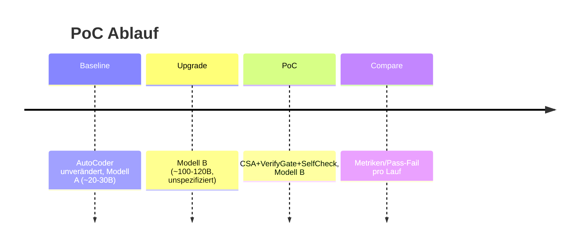

# PoC zur Hallucination‑Reduktion in AutoCoder mit Feasibility‑Margin

## Executive Summary
Ziel ist ein **Proof‑of‑Concept**, der beim Wechsel von ~20–30B auf ~100–120B LLMs Halluzinationen reduziert, indem AutoCoder Aufgaben **entkoppelt**, **Interpretations‑Slack explizit zulässt** und **frühe Akzeptanztests** erzwingt. Kernänderung: **Contract+Slack+Acceptance (CSA)** wird als feste Struktur in Tasks *und* Agent‑Prompts injiziert, plus ein leichter **Verify‑Gate + SelfCheck‑Sampling (2–3 Runs)**. Grundlage: AutoCoder‑Pipeline in `autocoder.py`. fileciteturn4file0

## Repos und Ausgangslage
AutoCoder orchestriert Tasks via Initializer→Refactor→Details→Context und führt Befehle in `playground/` aus. fileciteturn4file0  
Die Space‑Shooter README dokumentiert eine **funktionierende, AI‑erstellte App** (Start von `SpaceShooter.pex` unter Linux via `SDL_AUDIODRIVER=dummy python3.10 …`). fileciteturn7file0  
Externe Kontext‑Embeddings werden über `sentence_transformers/transformers/pandas/numpy` erzeugt. fileciteturn9file0

## Minimale Pipeline‑Änderung
**Delta (ein Eingriff, PoC‑tauglich):**
1) **Einheitliche Output‑Kontrakte**: `code_writer_agent` *muss* JSON `{"code":"..."}` liefern (aktuell widersprüchlich; Parser erwartet JSON). fileciteturn4file0  
2) **CSA‑Block verpflichtend** in *jedem Task* (Description + isolated_context).  
3) **Verify‑Gate nach jedem Schreib/Refactor‑Schritt** + **SelfCheck‑Sampling** (2–3 Kandidaten, Varianz‑Score → ggf. Refactor). Motiviert durch CoVe (Verify‑Schritte senken Halluzinationen) citeturn2view0 und SelfCheckGPT (Divergenz über Samples als Signal). citeturn2view1

```mermaid
flowchart LR
O[Objective]-->TI[Init Tasks (CSA)]-->TR[Refactor Tasks]-->TD[Add Details]-->TC[Add isolated_context]
TC-->L{pro Task}
L-->S[SelfCheck: 2-3 Samples]
S-->W[Write/Refactor best]
W-->V[Verify Gate: compile+import+assert]
V--pass-->N[next Task]
V--fail-->R[Refactor w/ errors]-->V
```

## System‑Message‑Templates und konkrete Artefakte
**Feasibility‑Margin‑Klausel (an *alle* Agent‑system_message anhängen, exakt):**  
„Feasibility‑Margin: Halte Anforderungen innerhalb expliziter Constraints. Triff nur minimale, deklarierte Annahmen. Erfinde keine Dateien/APIs. Erlaube Varianten nur im ‘Slack’. Wenn Konflikt/Unklarheit: nenne Annahme im Output‑Kontrakt statt zu halluzinieren.“

**CSA‑Template (in Initializer/Refactor/Details/Context erzwingen, exakt):**  
„TASK MUSS enthalten: Contract(‘muss’), Slack(‘darf’), Assumptions(‘angenommen’), Acceptance(‘prüfe via Befehle/Beispiele’).“

**JSON‑Checklist (inkl. isolated_context, exakt/minimal):**
```json
{"tasks":[
{"id":1,"description":"Run a command to create folder 'project'. Contract: create only this folder. Slack: use mkdir -p. Assumptions: cwd=playground. Acceptance: ls shows project/","file_path":"project","isolated_context":"AutoCoder commands run with cwd='playground'."},
{"id":2,"description":"Run a command to create empty files. Contract: create project/temperature_converter.py and project/main.py only. Slack: touch ok. Assumptions: folder exists. Acceptance: ls project shows both files.","file_path":"project","isolated_context":"project/ exists from Task 1."},
{"id":3,"description":"Write code to implement TemperatureConverter in project/temperature_converter.py. Contract: single class TemperatureConverter with methods celsius_to_fahrenheit(float)->float and fahrenheit_to_celsius(float)->float; no extra I/O. Slack: implementation style free. Assumptions: IEEE float. Acceptance: python -c \"from temperature_converter import TemperatureConverter;tc=TemperatureConverter();assert tc.celsius_to_fahrenheit(0)==32\" (run from project dir via sys.path or by executing main).","file_path":"project/temperature_converter.py","isolated_context":"File exists empty. main.py will import TemperatureConverter; keep names exact."},
{"id":4,"description":"Write code to implement CLI in project/main.py. Contract: import TemperatureConverter; read value+unit (C/F), convert to other unit, print result; handle invalid unit. Slack: prompt text format free. Assumptions: input unit is 'C' or 'F' (case-insensitive). Acceptance: printf '100\\nC\\n'|python main.py prints 212 (or 212.0).","file_path":"project/main.py","isolated_context":"temperature_converter.py defines TemperatureConverter. Run as: python project/main.py from playground."},
{"id":5,"description":"Run a command to verify. Contract: no edits, only checks. Slack: combine commands. Acceptance: python -m py_compile project/*.py && python - <<'PY'\\nimport subprocess,sys\\nfrom pathlib import Path\\nPY","file_path":"project","isolated_context":"Both files should now contain valid Python."}
]}
```

**Befehle für File‑Creation (lokal, exakt):**
```bash
mkdir -p playground/project
touch playground/project/temperature_converter.py playground/project/main.py
```

**Code: `project/temperature_converter.py` (exakt):**
```python
class TemperatureConverter:
    def celsius_to_fahrenheit(self, celsius: float) -> float:
        return (celsius * 9.0 / 5.0) + 32.0

    def fahrenheit_to_celsius(self, fahrenheit: float) -> float:
        return (fahrenheit - 32.0) * 5.0 / 9.0
```

**Code: `project/main.py` (exakt):**
```python
from temperature_converter import TemperatureConverter

def main() -> None:
    tc = TemperatureConverter()
    value_str = input("Temperaturwert: ").strip()
    unit = input("Einheit (C/F): ").strip().upper()

    try:
        value = float(value_str)
    except ValueError:
        print("Ungültiger Zahlenwert.")
        return

    if unit == "C":
        result = tc.celsius_to_fahrenheit(value)
        print(f"{result}")
    elif unit == "F":
        result = tc.fahrenheit_to_celsius(value)
        print(f"{result}")
    else:
        print("Ungültige Einheit (nutze C oder F).")

if __name__ == "__main__":
    main()
```

## Verify‑Gate, SelfCheck, Metriken, Experiment‑Protokoll
**Verify‑Gate (leichtgewichtig):**
```bash
python -m py_compile playground/project/temperature_converter.py playground/project/main.py
python - <<'PY'
import subprocess,sys,math
from pathlib import Path
import importlib.util
# run CLI smoke
p=subprocess.run(["python","playground/project/main.py"],input="100\nC\n",text=True,capture_output=True)
assert p.returncode==0 and "212" in p.stdout
PY
```

**SelfCheck‑Sampling (2–3 Runs, Trigger):** pro Code‑Task 3 Samples (T≈0.2), parse JSON, berechne Varianz‑Score = 1−Jaccard(Token‑Set) über Samples; wenn Score>τ **oder** Verify‑Gate fail → `code_refactor_agent` mit Fehlermeldung+Contract. (Sampling‑Divergenz als Halluzinationssignal) citeturn2view1

| Metrik | Messung |
|---|---|
| Missing imports | py_compile/import‑Fehler zählen |
| Fab. filenames | Task referenziert nicht existierende Pfade |
| Test pass rate | Anteil Verify‑Gate pass |
| Varianz‑Score | SelfCheck‑Divergenz pro Task |



**Lokales Protokoll (Pass/Fail):**  
1) `objective.txt` mit Temperatur‑Objective; 2) AutoCoder Run (Baseline) → Metriken loggen; 3) PoC‑Patch (Prompts+Gate) → Run; **Pass**, wenn: keine erfundenen Pfade/Imports, Verify‑Gate ok, Varianz‑Score sinkt signifikant (vorher/nachher).
